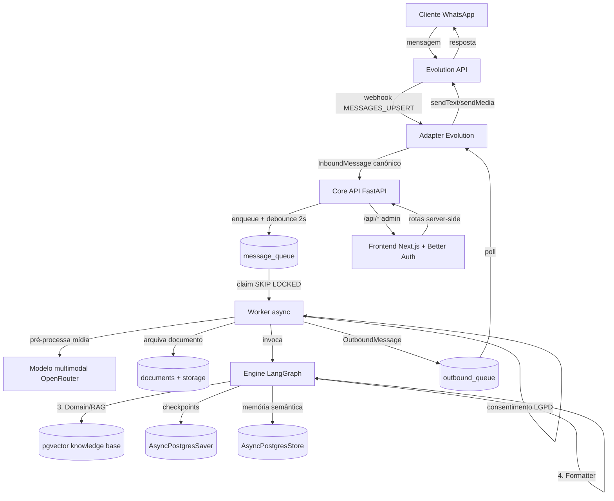

# TDD — Agentes de IA para WhatsApp (multi-canal)

| Campo | Valor |
| --- | --- |
| Tech Lead | @TechLead |
| Product Manager | N/A |
| Team | @Backend, @Worker, @Adapters, @Frontend, @DevOps |
| Epic/Ticket | N/A |
| Figma/Design | N/A |
| Status | Draft |
| Created | 2026-08-10 |
| Last Updated | 2026-08-10 |

---

## 2. Context

Este projeto cria um **harness production-ready para agentes de IA que atendem
clientes via WhatsApp**, com a premissa arquitetural de que **outros canais
(Telegram, Instagram, Web) podem ser adicionados no futuro sem redesenho**. O
domínio de negócio inicial é o **atendimento contábil** de um escritório:
FAQ fiscal/tributário, recebimento e classificação de documentos (comprovantes,
notas fiscais, recibos), agendamento de reuniões e escalonamento para
atendimento humano quando necessário.

O comportamento do agente é definido com **LangChain/LangGraph**; a
infraestrutura do harness cuida do resto: recebimento de mensagens, debounce de
mensagens rápidas, processamento assíncrono via fila em PostgreSQL, persistência
de contexto (checkpointer) e memória semântica (store + pgvector), processamento
de mídia via modelo multimodal, consentimento LGPD, handoff humano com
notificação ao grupo interno e painel administrativo para operação.

**Background**: atendimento contábil hoje é manual e reativo — clientes enviam
mensagens no WhatsApp em horário comercial e esperam respostas humanas para
perguntas repetitivas (prazos, documentos mensais, guias de imposto) e envio de
documentos. Não existe automação com memória, classificação de documentos ou
base de conhecimento fiscal consultável.

**Stakeholders**: clientes do escritório (usuários finais), equipe contábil
(interna — responde handoffs e confere classificações), administração (monitora
fila, métricas e conversas via painel), jurídico/compliance (LGPD —
consentimento e retenção de dados pessoais).

---

## 3. Definição do Problema & Motivação

### Problemas que estamos resolvendo

- **Perguntas repetitivas consomem a equipe contábil**: dúvidas comuns (prazos,
  documentos mensais, status) ocupam horas/dia do time.
  - Impacto: custo operacional alto, tempo de resposta lento (horário comercial apenas).
- **Timeouts de webhook e latência de LLM**: LLMs levam 5–30s para responder;
  serviços de canal (Evolution API/Twilio) esperam resposta rápida.
  - Impacto: design ingênuo (chamar LLM inline no webhook) falha em produção.
- **Mensagens rápidas e consecutivas**: usuários enviam "Oi", "tudo bem?",
  "preciso de uma guia" em segundos — execuções múltiplas e caras de LLM, com
  contexto fragmentado.
  - Impacto: custo por atendimento alto, respostas incoerentes.
- **Documentos sem classificação estruturada**: fotos de comprovantes e notas
  fiscais chegam pelo WhatsApp e são tratadas manualmente.
  - Impacto: retrabalho, risco de perda de informações.
- **Sem memória do cliente**: cada conversa começa do zero — regime tributário,
  pendências e preferências são repetidos.
  - Impacto: experiência ruim, contexto perdido entre sessões.

### Por que agora?

- **Driver técnico**: LangGraph 1.x oferece checkpointer/store nativos com
  PostgreSQL e middleware de contexto — base madura para o harness.
- **Driver de negócio**: digitalização do atendimento contábil é diferencial
  competitivo; automação com handoff humano cobre casos complexos sem perder
  qualidade.
- **Driver regulatório**: LGPD exige consentimento explícito e controle sobre
  dados pessoais — o harness precisa ser construído com esse gate desde o início.

### Impacto de NÃO resolver

- **Negócio**: perda de competitividade, dependência total de equipe para
  atendimento, crescimento sem escala.
- **Técnico**: acúmulo de soluções pontuais (scripts, bots frágeis sem fila,
  sem memória, sem observabilidade) — dívida técnica e risco operacional.
- **Usuários**: espera por resposta humana em horário comercial, sem
  acompanhamento de documentos ou agendamento automatizado.

---

## 4. Escopo

### ✅ In Scope (V1 — MVP)

- Recebimento de mensagens de texto, imagem, áudio, vídeo e documento via
  WhatsApp (Evolution API) com adaptador standalone.
- Debounce de mensagens de texto consecutivas (2s configurável) com mídia
  imediata e flush de texto pendente.
- Processamento assíncrono: API edge (202 imediato) + fila PostgreSQL + worker.
- Engine multiagente LangGraph: Router (triagem), Visual Extractor (extração
  Pydantic de mídia), Domain/RAG Node (lógica + knowledge base fiscal) e
  Formatter (resposta para o canal).
- Memória: checkpointer (curto prazo, `thread_id`) + store semântico (longo
  prazo, `user_id`) com tools `save_memory`/`read_memory`.
- Handoff humano com protocolo, setor, urgência e notificação ao grupo interno.
- Consentimento LGPD (tabela `consents`) antes de processar dados.
- Painel administrativo: conversas, fila, handoffs, documentos,
  métricas — com autenticação (Better Auth) e token interno.
- Rate limit por telefone + rate limit de LLM; retry com backoff; logs
  estruturados; health check.
- Deploy containerizado documentado (docker-compose + Railway).

### ❌ Out of Scope (V1)

- Canais além do WhatsApp (arquitetura preparada, entrega futura).
- Múltiplas mídias em um único evento (ex.: 2 fotos no mesmo webhook).
- Fila distribuída externa (Redis/RabbitMQ) — PostgreSQL é a fila.
- Rate limit distribuído multi-instância (in-memory por processo).
- Atendimento síncrono público (webhook síncrono existe apenas para dev).
- Integração com sistemas legados do escritório (ERP/SPED) e agendamento
  automatizado via Google Calendar.

### 🔮 Considerações Futuras (V2+)

- Adapters para Telegram, Instagram e Web Widget.
- Agendamento via Google Calendar, inicialmente em fase posterior ao MVP.
- Rate limit distribuído (Redis) e fila dedicada se o volume exigir.
- Multi-tenancy (vários escritórios usando o mesmo harness).
- Enriquecimento de RAG com documentos do cliente (obrigações mensais).
- Integração com API oficial WhatsApp Cloud (Meta).

---

## 5. Solução Técnica

### Visão Geral da Arquitetura

Sistema orientado a **harness**: o agente (LangGraph) é um componente do
sistema, não o sistema inteiro. A borda HTTP é rápida e não executa IA; a IA
roda em um worker separado consumindo uma fila em PostgreSQL; canais externos
ficam isolados atrás de adaptadores standalone que falam um formato canônico.

**Princípios de design**:

- **Canal desacoplado**: adapters convertem payload proprietário →
  `InboundMessage`/`OutboundMessage` canônicos (Pydantic). O core nunca conhece
  o canal.
- **Borda rápida, IA assíncrona**: API valida, rate-limita, enfileira e
  responde 202; o worker executa o grafo (5–30s) sem timeout de webhook.
- **PostgreSQL como fila**: `message_queue` com `FOR UPDATE SKIP LOCKED`,
  lease temporal e retry com backoff — ACID com o restante do estado.
- **Memória em duas camadas**: checkpointer (conversa, `thread_id`) + store
  semântico (usuário, `user_id`) com tools explícitas.
- **Política de contexto auditável**: middleware `trim`/`summarize`/`none`
  selecionado por configuração.
- **Segurança e LGPD por default**: token interno timing-safe; consentimento
  obrigatório antes de processar dados.

**Componentes-chave**:

- **Adapters** (services standalone): Evolution API (webhook `MESSAGES_UPSERT`,
  valida `apikey`, JID → E.164); fazem poll de outbound e enviam a resposta ao
  canal. A arquitetura suporta novos adapters (Twilio, Meta) sem alterar o core.
- **Core API (FastAPI)**: `POST /v1/messages/inbound` (debounce + rate limit),
  poll `GET /v1/messages/outbound`, confirmações `done`/`failed`, rotas admin.
- **Worker (async loop)**: claim com SKIP LOCKED → consentimento LGPD →
  pré-processa mídia (imagem/áudio/PDF) → arquiva documento → executa engine →
  produz `OutboundMessage`.
- **Engine multiagente (LangGraph)**: Router → Visual Extractor → Domain/RAG →
  Formatter; com checkpointer e store compartilhados (abertos no boot).
- **PostgreSQL**: fila de entrada/saída, conversas, handoffs, documentos,
  consents, checkpoints LangGraph, store semântico + pgvector, knowledge base
  (RAG).
- **Frontend (Next.js)**: painel admin com Better Auth; proxy server-side para
  as rotas `/api/*`.

### Diagrama de Arquitetura



### Fluxo de Dados (passo a passo)

1. **Cliente** envia mensagem no WhatsApp.
2. **Evolution API** entrega o evento ao adapter (webhook HTTP POST
   `MESSAGES_UPSERT`).
3. **Adapter** valida credenciais do canal, converte o payload proprietário em
   `InboundMessage` canônico (E.164, tipo, mídia) e publica em
   `POST /v1/messages/inbound`.
4. **Core API** resolve o `agent_id` via `channel_routing`, aplica rate limit
   por telefone, aplica debounce (concatena textos pendentes/reseta timer;
   mídia imediata com flush) e responde 202.
5. **Worker** reclama a mensagem (`queued → processing`, lease 60s), verifica
   consentimento LGPD e pré-processa mídia (imagem → descrição; áudio →
   transcrição; PDF → extração de texto).
6. **Engine LangGraph** é invocado com `thread_id = "{phone}:{agent}"` e
   `user_id = phone`: Router tria a intenção; Visual Extractor extrai campos
   estruturados de comprovantes/NF-e; Domain/RAG consulta a knowledge base e
   usa tools (handoff, documentos, memória); Formatter produz a
   resposta concisa para o canal.
7. **Worker** produz um `OutboundMessage` na `outbound_queue` e faz
   `mark_done` (upsert em `conversations`).
8. **Adapter** faz poll da fila de saída, envia ao WhatsApp e confirma
   `done`/`failed` no core.

### APIs & Endpoints

| Endpoint | Método | Descrição | Requisição | Resposta |
| --- | --- | --- | --- | --- |
| `/v1/messages/inbound` | POST | Publica mensagem canônica (adapter) | `InboundMessage` | `202 {"message_id"}` |
| `/v1/messages/outbound` | GET | Poll de respostas por canal | `?channel=&status=&limit=` | `[OutboundMessage]` |
| `/v1/messages/outbound/{id}/done` | POST | Confirma envio | — | 200 |
| `/v1/messages/outbound/{id}/failed` | POST | Falha/retry | `{"error"}` | 200 |
| `/v1/routing` | GET | Consulta rota canal→agente | `?channel=&identifier=` | `{"agent_id"}` |
| `/api/agents` | GET | Lista agentes do catálogo | — | lista |
| `/api/chats` | GET | Conversas paginadas | `?page=` | lista |
| `/api/chats/{phone}` | GET | Mensagens da conversa | — | lista |
| `/api/metrics` | GET | Métricas operacionais | — | JSON |
| `/api/queue` | GET | Estado da fila | — | JSON |
| `/api/handoffs` | GET/PATCH | Lista/atualiza handoffs | status | JSON |
| `/api/documents` | GET | Documentos (filtro) | `?phone=&status=` | lista |
| `/api/documents/{id}/download` | GET | Download (presigned/stream) | — | arquivo |
| `/health` | GET | Health check | — | 200/503 |

**Exemplo — inbound**:

```json
// POST /v1/messages/inbound
{
  "channel": "evolution",
  "channel_identifier": "escritorio",
  "phone_number": "+5511999999999",
  "message_type": "image",
  "body": null,
  "media": {
    "url": "https://evo.example/file/comprovante.jpg",
    "mime_type": "image/jpeg",
    "caption": "comprovante do mês",
    "filename": "comprovante.jpg"
  },
  "raw_payload": { "event": "MESSAGES_UPSERT" }
}

// Resposta 202
{ "message_id": 12345 }
```

### Alterações no Banco de Dados

**Novas tabelas** (PostgreSQL + pgvector):

- `message_queue` — fila inbound; campos: id, channel, phone_number, agent_id,
  thread_id, status (queued|processing|done|failed), process_after,
  lease_until, attempts, max_attempts, canonical_payload (JSONB), media_url,
  media_type, response, error. Índices: (status, process_after) parcial,
  (phone_number, agent_id).
- `outbound_queue` — fila de respostas por canal; payload JSONB; índice
  parcial (channel, status, process_after).
- `conversations` — agregado admin; PK (phone_number, agent_id).
- `channel_routing` — rota canal → agente; UNIQUE (channel, channel_identifier).
- `handoff_requests` — id, phone_number, thread_id, sector, summary, urgency,
  status (open|in_progress|resolved|cancelled), resolved_at.
- `documents` — id, phone_number, thread_id, storage_backend, storage_key,
  extracted_text, document_type, status (received|classified|archived).
- `consents` — phone_number (PK), consented, consented_at, terms_version.
- `kb_entries` — knowledge base RAG: content, metadata (JSONB), embedding
  vector(1536) com índice HNSW.
- Schemas LangGraph gerenciados pelas libs: `checkpoints`,
  `checkpoint_writes` (AsyncPostgresSaver), tabelas do AsyncPostgresStore.

**Estratégia de migração**: migrações SQL numeradas e idempotentes
(`CREATE TABLE IF NOT EXISTS`), aplicadas automaticamente no startup da API;
bootstrap do schema LangGraph também no startup (sem criação lazy por request).

**Estratégia de dados**: storage de documentos local (dev) ou S3 (prod) com
chave `{phone_sanitized}/{YYYYMMDD}/{uuid}-{filename}`; embeddings
`text-embedding-3-small` (1536 dims).

**Política da knowledge base fiscal**: a V1 usará quatro grupos de fontes:

- fontes oficiais (Receita Federal, legislação e portais governamentais);
- procedimentos internos, prazos e FAQs do escritório;
- conteúdo produzido ou revisado por especialistas do escritório;
- jurisprudência e soluções de consulta aplicáveis.

A publicação será feita por **curadoria manual**: cada entrada deve registrar
fonte, data de revisão, responsável e setor. O agente deve citar a fonte da
resposta; conteúdo sem fonte aprovada não pode ser usado em produção.

---

## 6. Riscos

| Risco | Impacto | Probabilidade | Mitigação |
| --- | --- | --- | --- |
| Custo de LLM com histórico longo e mensagens rápidas | Alto | Alta | Debounce (2s) + middleware trim/summarize + rate limit por telefone (30/h) + token bucket na factory de LLM |
| Timeout de webhook do canal (latência LLM 5–30s) | Alto | Alta | Desacoplamento API/worker: resposta 202 imediata; fila + worker |
| Falha da Evolution API (instabilidade de WhatsApp não-oficial) | Alto | Média | Retry com backoff (3 tentativas); monitoramento de health; arquitetura de adapters permite canal alternativo (Twilio/Meta) em fase posterior |
| Mensagens duplicadas por retry do canal | Médio | Média | Dedupe por `message_id` + lease com SKIP LOCKED + estados idempotentes |
| Alucinação em respostas fiscais/tributárias | Alto | Média | RAG com citação de fontes; confiança baixa → handoff humano; prompt com escopo claro |
| Vazamento de dados pessoais (LGPD) | Alto | Baixa | Gate de consentimento no worker; token interno em todas as rotas; secrets em env; revisão de logs (não logar PII) |
| Mídia corrompida/indisponível no download | Baixo | Média | Auto-resposta de erro de mídia; arquivamento best-effort sem interromper pipeline |
| Worker morto com lease ativo | Médio | Baixa | Expiração de lease (60s) + recovery; múltiplos workers sem duplicação |
| Mudança de contrato de API de canais externos | Médio | Média | Adapters isolados: mudança fica no adapter, core intocado |
| Escopo creep (muitos canais/agentes no MVP) | Médio | Alta | Escopo V1 explícito; catálogo de agentes + adapters extensíveis sem redesenho |

**Score**: Impacto Alto + Probabilidade Alta nos custos de LLM e timeouts —
são os riscos que o design (debounce + fila) mitiga estruturalmente.

---

## 7. Plano de Implementação

| Fase | Tarefa | Descrição | Owner | Status | Estimativa |
| --- | --- | --- | --- | --- | --- |
| **F0 — Scaffolding** | Projeto + config | pyproject/uv, Settings (pydantic-settings), logging structlog, `/health`, Makefile | @Backend | TODO | 1d |
| **F1 — Banco** | Migrações + pool | Migrações idempotentes (todas as tabelas), runner no startup, pool psycopg | @Backend | TODO | 2d |
| **F2 — Fila** | Queue core | `enqueue_or_buffer` (debounce), `claim_next` (SKIP LOCKED), `mark_done`/`mark_failed` (backoff) | @Backend | TODO | 3d |
| **F3 — Contratos + API** | Modelos canônicos + endpoints | `InboundMessage`/`OutboundMessage`, `/v1/messages/*`, `/v1/routing`, rate limit, token | @Backend | TODO | 3d |
| **F4 — Worker mínimo** | Loop + agente simples | Claim → consentimento → agente texto → outbound → mark_done | @Worker | TODO | 3d |
| **F5 — Checkpointer** | Memória curto prazo | AsyncPostgresSaver no boot, thread_id, middleware trim | @Worker | TODO | 2d |
| **F6 — Mídia** | Pré-processamento | Imagem/áudio via multimodal, PDF via pypdf, arquivamento docs | @Worker | TODO | 3d |
| **F7 — Memória semântica** | Store + tools | AsyncPostgresStore + embeddings, save_memory/read_memory | @Worker | TODO | 3d |
| **F8 — Tools de domínio** | Handoff e documentos | create_handoff (notificação grupo), register_document; agendamento fica para fase posterior | @Worker | TODO | 2d |
| **F9 — LGPD** | Consentimento + retenção | Tabela consents, gate no worker, textos SIM/NÃO, job de expiração (retenção 24 meses) | @Worker | TODO | 2d |
| **F10 — Painel admin** | Rotas + frontend | `/api/*` admin, Next.js + Better Auth, páginas (chats, queue, handoffs, docs) | @Frontend | TODO | 4d |
| **F11 — Adapter WhatsApp** | SDK + Evolution | channels-sdk, adapter Evolution (webhook+apikey+outbound); Twilio fica para fase posterior | @Adapters | TODO | 3d |
| **F12 — Engine multiagente** | Router/Extractor/RAG/Formatter | Nós explícitos; extração Pydantic de comprovantes; roteamento de intenção | @Worker | TODO | 5d |
| **F13 — RAG de domínio** | Knowledge base | `kb_entries`, workflow de curadoria manual (fonte/revisão/responsável/setor), ingestão offline, search tool com citação | @Backend | TODO | 3d |
| **F14 — Hardening/deploy** | Docker + Railway + stress + custo | Dockerfiles, docker-compose, deploy Railway, stress test, medição de custo LLM + alertas de orçamento, revisão CORS/segurança | @DevOps | TODO | 4d |

**Total estimado**: ~43 dias (8-9 semanas) para 1 dev por área em paralelo.

**Dependências**:

- F1 e F3 devem estar completas antes de F4 (worker precisa de fila e contratos).
- F4 antes de F5–F9 (base funcional primeiro, memória/tools depois).
- F6 (mídia) é pré-requisito de F12 (Visual Extractor usa o pipeline de mídia).
- F10 (painel) depende de F3 (rotas admin usam os mesmos padrões).
- F11 (adapters) pode rodar em paralelo após F3.
- F14 requer F0–F13.

---

## 8. Considerações de Segurança

### Autenticação & Autorização

- **Autenticação interna**: `Authorization: Bearer <INTERNAL_SERVICE_TOKEN>`
  com comparação timing-safe (`hmac.compare_digest`) em todas as rotas
  `/v1/*` e `/api/*`.
- **Autenticação do canal**: cada adapter valida suas próprias credenciais —
  apikey na Evolution API; assinatura HMAC em canais que a suportem (ex.:
  Twilio, fase posterior) — e rejeita requests sem elas antes de qualquer
  processamento.
- **Autorização admin**: Better Auth (login/sessão) no frontend; rotas
  administrativas só são chamadas server-side via Next.js, usando o token
  interno — nunca exposto ao browser.

### Proteção de Dados

- **Em trânsito**: TLS 1.3 em todos os endpoints públicos (webhooks, painel).
- **Em repouso**: criptografia da instância de banco de dados (provedor);
  storage de documentos em bucket S3/R2 com acesso privado e URLs presignadas
  para download.
- **Secrets**: variáveis de ambiente / secret manager (nunca no código ou na
  imagem Docker); rotação de `INTERNAL_SERVICE_TOKEN` e chaves de canal.

**PII coletada**: número de telefone (E.164), nome (se informado), conteúdo de
mensagens, documentos enviados, dados cadastrais inferidos (CNPJ, regime
tributário) na memória semântica.

- **Base legal**: consentimento explícito (LGPD) registrado na tabela
  `consents` antes de processar qualquer dado pessoal.
- **Retenção**: mensagens e documentos retidos por **24 meses**. Prazos legais
  específicos podem exigir retenção maior para determinados documentos e devem
  ser aprovados pelo responsável de compliance.
- **Exclusão**: o texto de consentimento informa o direito de solicitar
  exclusão; rota admin para exclusão de dados de um telefone.

### Conformidade (LGPD)

| Regulamentação | Requisito | Implementação |
| --- | --- | --- |
| **LGPD** | Consentimento explícito | Gate no worker: primeiro contato → mensagem de consentimento; processa apenas após `SIM` exato |
| **LGPD** | Minimização de dados | Memória semântica só com fatos relevantes para o atendimento; tools explícitas decidem o que salvar |
| **LGPD** | Direito de exclusão | Suporte a apagar dados do usuário (banco + storage + memória) |

### Práticas de Segurança

- ✅ Validação de entrada em todos os endpoints (Pydantic).
- ✅ SQL injection: queries parametrizadas (psycopg) — nunca concatenação.
- ✅ XSS/CSRF: painel com sessões seguras e chamadas server-side; CORS
  restrito em produção.
- ✅ Rate limiting: 30 msgs/hora por telefone (sliding window) + token bucket
  na factory de LLM (limita custo e abuso).
- ✅ Audit logging: eventos de consentimento, handoff e admin logados
  (sem PII sensível).

### Gestão de Segredos

- **API Keys**: `OPENROUTER_API_KEY`, `EVOLUTION_API_KEY`, credenciais S3 e
  Google Service Account em `.env`/secret manager; backend-only.
- **Rotação**: política definida (ex.: 90 dias) para tokens internos e chaves
  de canal.
- **Webhook signatures**: validação obrigatória de apikey/assinatura nos
  adapters; tentativas inválidas logadas (`evolution_apikey_invalid`).

---

## 9. Estratégia de Testes

| Tipo de Teste | Escopo | Alvo de Cobertura | Abordagem |
| --- | --- | --- | --- |
| **Unit** | Tools isoladas, fila (debounce/lease/backoff), consentimento, media, rotas admin | > 80% | pytest + mocks (pool mock, httpx mock) |
| **Integration** | Fila ↔ worker ↔ agente com PostgreSQL real | Caminhos críticos | pytest + DB local (docker) |
| **E2E** | Adapter → core → worker → outbound com canal mock | Happy path + erros | docker-compose + script |
| **Contract** | Contratos canônicos core ↔ adapters | Validação de payloads | testes de schema Pydantic |
| **Load** | Fila sob carga (N mensagens) | Baseline | script `stress/` |

### Cenários de Teste

**Unit**:

- ✅ Debounce: concatena textos e reseta timer; mídia entra imediata e faz
  flush de texto pendente.
- ✅ Claim: SKIP LOCKED não entrega a mesma mensagem a dois workers; lease
  expira e permite recovery.
- ✅ Retry: backoff `attempts * 5`, falha final após `max_attempts`.
- ✅ Consentimento: primeiro contato não processa; `SIM` aceita; `NÃO` encerra;
  texto não-exato é tratado como não-resposta.
- ✅ Tools: handoff (valida setor, cria protocolo), documentos
  (received → classified), memória (save/read no namespace do usuário).
- ✅ Edge cases: payload inválido → 400; sem token → 401; rate limit → 429.

**Integration**:

- ✅ POST `/v1/messages/inbound` → linha `queued` com `process_after` ≈ now+2s.
- ✅ Worker processa texto → `OutboundMessage` enfileirada → `mark_done`.
- ✅ Mídia: imagem descrita via modelo mock; PDF com texto extraído.
- ✅ Checkpointer: 2 mensagens seguidas preservam contexto.

**E2E**:

- ✅ Mensagem real (canal mock) → resposta via fila outbound.
- ✅ Handoff: cliente pede humano → protocolo + registro + notificação mock.
- ✅ Mídia corrompida → auto-resposta de erro, sem crash do worker.
- ✅ Falha de LLM → retry com backoff → falha final registrada.

**Load**:

- Alvo: 100 mensagens em rajada curta; debounce reduz execuções;
  fila consome sem duplicação; métricas refletem falhas/tempos.

### Gerenciamento de Dados de Teste

- Pool mock padrão do harness (MagicMock/AsyncMock) para camada DB sem banco.
- Banco de teste separado (nunca produção); fixtures para payloads canônicos.
- Limpeza após cada teste.

---

## 10. Monitoramento & Observabilidade

### Métricas a Rastrear

| Métrica | Tipo | Threshold de Alerta | Dashboard |
| --- | --- | --- | --- |
| `api.inbound_latency` | Latência | p95 > 1s por 5min | Grafana/painel interno |
| `api.error_rate` | Taxa de erro | > 1% por 5min | Grafana |
| `queue.size` | Gauge | > 100 por 10min | Painel `/api/queue` |
| `queue.failed_today` | Counter | > 10 | Painel `/api/metrics` |
| `worker.avg_processing_time` | Duração | > 60s por 10min | Painel `/api/metrics` |
| `llm.token_bucket_denied` | Counter | > 50 por 5min | Logs |
| `handoff.created` | Counter | qualquer pico anômalo | Painel `/api/handoffs` |
| `evolution_webhook_publish_failed` | Counter | > 5 por 5min | Logs |
| `llm.monthly_cost` | Custo acumulado | > 70% e > 90% do orçamento (R$ 300) | Painel `/api/metrics` |

### Logs Estruturados (JSON)

```json
{
  "level": "info",
  "timestamp": "2026-08-10T10:00:00Z",
  "message": "message_processed",
  "context": {
    "message_id": 12345,
    "phone_number": "+5511999999999",
    "agent_id": "contabil_assistant",
    "response_length": 320,
    "attempt": 1
  }
}
```

**O que logar**: todos os eventos de ciclo de vida (`message_enqueued`,
`processing_message`, `message_processed`, `message_processing_error`,
`outbound_produced`, `consent_requested`, `handoff_created`, falhas de
integração), sempre com `message_id`, `phone_number`, `agent_id`.

**O que NÃO logar**: tokens, chaves, conteúdo completo de mensagens com PII,
documentos.

### Alertas

| Alerta | Severidade | Canal | Ação |
| --- | --- | --- | --- |
| `api.error_rate` > 5% | P1 (Crítico) | Slack/Telegram interno | Investigar imediato; rollback se deploy recente |
| Evolution API fora (webhook falhando) | P1 (Crítico) | Slack/Telegram interno | Verificar instância; acionar contingência de canal (fase posterior) |
| `queue.size` > 100 | P2 (Alto) | Slack | Verificar worker (morto? LLM lento?) |
| `llm.rate_limited` frequente | P2 (Alto) | Slack | Avaliar custo/limites do OpenRouter |
| Orçamento LLM > 90% (R$ 300/mês) | P2 (Alto) | Slack | Reduzir/bloquear processamento não essencial |

### Dashboards

**Operacional** (painel admin `/api/metrics` + `/api/queue`):

- Total de mensagens hoje, falhas hoje, tempo médio de processamento, tamanho
  da fila, contadores por status.

**Negócio**:

- Conversas ativas, handoffs por status, documentos recebidos/classificados.

---

## 11. Plano de Rollback

### Estratégia de Deploy

- **Feature flags**: `MEMORY_ENABLED`, `GOOGLE_CALENDAR_ENABLED`,
  `DOCUMENTS_ENABLED` — desabilitam capacidades sem redeploy.
- **Rollout em fases**: deploy em staging → smoke test → produção
  (adapter em sandbox → cutover para produção).

### Gatilhos de Rollback

| Gatilho | Ação |
| --- | --- |
| `api.error_rate` > 5% por 5min | **Rollback imediato** — reverter versão da API/worker |
| Latência p95 > 3s por 10min | **Investigar** — rollback se sem correção rápida |
| Webhook de canal falhando > 50% | **Rollback** — reverter adapter |
| Migração de banco falha | **PARAR** — não prosseguir; investigar |
| Respostas com conteúdo incorreto (feedback interno) | **Handoff forçado** + desabilitar agente (`channel_routing`) |

### Passos de Rollback

1. **Imediato (< 5min)**:
   - Redirecionar rota do canal para outro `agent_id` (ou desabilitar a rota)
     via `channel_routing` — sem redeploy.
   - Desabilitar flags de capacidade (memória, docs).
2. **Deploy**: reverter para versão anterior da imagem (Railway: deploy do
   commit anterior).
3. **Banco** (se schema mudou): migrações são idempotentes e aditivas na v1 —
   rollback de schema via nova migração reversa; snapshot do banco antes de
   migrações em produção.
4. **Comunicação**: notificar canal interno, registrar incidente, post-mortem
   em 24h.

### Pós-rollback

- Análise de causa raiz em 24h; correção; re-teste completo (suíte + cenários
  da causa); re-deploy seguindo o mesmo rollout em fases.

### Considerações de Rollback de Banco

- Migrações sempre aditivas/retrocompatíveis na v1 (sem drops destrutivos).
- Backup/snapshot antes de aplicar migrações em produção.
- Procedimento de rollback testado em staging.

---

## 12. Métricas de Sucesso

| Métrica | Baseline | Alvo | Medição |
| --- | --- | --- | --- |
| Latência da API de inbound (p95) | N/A (novo) | < 300ms | painel/logs |
| Respostas automatizadas sem handoff | N/A | > 70% dos atendimentos | `/api/metrics` + handoffs |
| Documentos classificados automaticamente | 0% (manual) | > 80% | `/api/documents` |
| Tempo de resposta ao cliente | Horas (manual) | < 60s | fila + processed_at |
| Erros de processamento | N/A | < 1% | `/api/metrics` |
| Custo por conversa (LLM) | N/A (baseline pós-F14) | ≤ R$ 0,50/conversa (recalibrar após baseline) | métricas de tokens |

**Limite financeiro inicial**: orçamento máximo de **R$ 300/mês** para LLM e
embeddings durante o MVP. O sistema deve emitir alertas ao atingir 70% e 90%
desse limite e reduzir ou bloquear processamento não essencial ao ultrapassar
100%.

**Métricas de negócio**:

- Redução de atendimentos manuais repetitivos em 50% (medido por handoffs vs
  resolvidos por agente).
- Adoção: % de clientes usando o canal automatizado após 30 dias.

**Métricas técnicas**:

- Zero incidentes P1 nos primeiros 30 dias em produção.
- Cobertura de testes > 80%.
- 100% dos endpoints públicos documentados.

---

## 13. Glossário

| Termo | Descrição |
| --- | --- |
| **Harness** | Infraestrutura operacional em volta do agente: fila, worker, memória, observabilidade, canais |
| **Debounce** | Agrupamento de mensagens rápidas do mesmo usuário em uma única execução |
| **Checkpointer** | Persistência do histórico da conversa por `thread_id` (AsyncPostgresSaver) |
| **Store semântico** | Memória de longo prazo por `user_id` com busca por similaridade (AsyncPostgresStore + pgvector) |
| **Thread_id** | `"{phone}:{agent}"` — chave da conversa no checkpointer |
| **Handoff** | Escalonamento para atendimento humano com protocolo e notificação |
| **RAG** | Recuperação de conhecimento da base (pgvector) para fundamentar respostas |
| **Adapter** | Serviço standalone que converte payload do canal ↔ formato canônico |
| **Outbound** | Mensagem de resposta produzida pelo core e enviada pelo adapter |
| **Lease** | Lock temporal que impede dois workers de processar a mesma mensagem |
| **Visual Extractor** | Nó que extrai dados estruturados (Pydantic) de mídia via visão computacional |

**Siglas**:

- **API**: Application Programming Interface
- **LGPD**: Lei Geral de Proteção de Dados
- **PII**: Personally Identifiable Information
- **E.164**: formato internacional de número de telefone
- **HNSW**: algoritmo de índice vetorial usado pelo pgvector

---

## 14. Alternativas Consideradas

| Opção | Prós | Contras | Por que não escolhida |
| --- | --- | --- | --- |
| **PostgreSQL como fila** (escolhida) | + Zero moving parts; ACID com estado; SKIP LOCKED maduro | - Não escala como fila dedicada; polling | ✅ **Escolhida** — simplicidade e consistência para o volume v1 |
| Redis/RabbitMQ como fila | + Alto throughput; DLQ nativo | - Infra extra; consistência entre fila e estado | Adiar para V2 se volume exigir |
| **Engine multiagente com nós explícitos** (escolhida) | + Capacidades testáveis isoladamente; rotas auditáveis | - Mais código que um ReAct único | ✅ **Escolhida** — extração estruturada e RAG exigem nós próprios |
| `create_agent` ReAct único | + Simples; rápido de iterar | - Extração/RAG no prompt; difícil testar por capacidade | Base de partida, evoluída para nós na F12 |
| **Adapters standalone** (escolhida) | + Canal isolado; falha contida; sem redesenho p/ canal novo | - N serviço para N canais | ✅ **Escolhida** — requisito explícito de multi-canal futuro |
| Canal dentro do core | + Um serviço só | - Core acoplado; mudança de canal exige deploy do core | Violaria P1 (canal desacoplado) |
| **Evolution API** (escolhida) | + Gratuita, sem custo por mensagem; multi-instância | - WhatsApp não-oficial (risco de ban) | ✅ **Escolhida** — custo; canal alternativo (Twilio/Meta) em fase posterior |
| Twilio como canal único | + Oficial, estável | - Custo por mensagem; sandbox limitado | Adiado para fase posterior (decisão 6) |

**Critérios de decisão**:

1. Simplicidade operacional (peso 35%) — time pequeno, PostgreSQL já é fonte de verdade.
2. Custo (peso 25%) — Evolution API sem custo por mensagem.
3. Extensibilidade multi-canal (peso 25%) — adapters standalone.
4. Estabilidade (peso 15%) — mitigado por retries, fallback e monitoramento.

**Por que a combinação escolhida venceu**: o harness entrega o valor (fila,
memória, observabilidade) independente do canal e do formato de agente —
decisões que sobrevivem à troca de Evolution→Meta Cloud API ou ReAct→nós.

---

## 15. Dependências

| Dependência | Tipo | Owner | Status | Risco |
| --- | --- | --- | --- | --- |
| Evolution API (instância + webhook) | Externo | @Adapters | A configurar | Médio (WhatsApp não-oficial) |
| Twilio (número + API Key) | Externo | @Adapters | Fase posterior, não obrigatório na V1 | Baixo |
| OpenRouter (LLM + multimodal + embeddings) | Externo | @Backend | A configurar (API key) | Baixo |
| Google Calendar (Service Account) | Externo | @Worker | Fase posterior ao MVP | Baixo |
| PostgreSQL + pgvector | Infraestrutura | @DevOps | A configurar | Baixo |
| Storage S3/R2 (documentos) | Externo | @DevOps | Opcional | Baixo |
| Node.js/Next.js (painel) | Infraestrutura | @Frontend | OK | Baixo |

**Requisitos de aprovação**:

- [ ] Revisão de segurança (sistema com PII/auth).
- [ ] Compliance LGPD sign-off (consentimento + retenção).
- [ ] Ops pronto para monitoramento (logs JSON, métricas).
- [ ] Product sign-off no escopo V1.

**Blockers**:

- OPENROUTER_API_KEY para desenvolvimento (F4+).
- Instância Evolution API para teste real (F11).
- Credenciais Google Calendar não bloqueiam o MVP; serão necessárias apenas na
  fase de agendamento posterior.

---

## 16. Requisitos de Performance

| Métrica | Requisito | Método de Medição |
| --- | --- | --- |
| Latência API inbound (p50) | < 150ms | logs/tracing |
| Latência API inbound (p95) | < 300ms | logs/tracing |
| Resposta ao cliente (fim-a-fim) | < 60s (inclui LLM) | processed_at − received_at |
| Throughput inbound | 50 msg/s sustentado | stress test |
| Disponibilidade | 99.9% | uptime monitor |
| Tempo de query de banco | < 50ms (p95) | slow query log |

**Plano de load test**: baseline 100 mensagens; pico 1000 mensagens em rajada
curta (validar debounce); verificar fila zerando e sem duplicação.

**Escalabilidade**:

- Horizontal: + réplicas de worker (SKIP LOCKED); + réplicas da API (stateless).
- Banco: índices parciais na fila; HNSW para vetores; réplica de leitura se
  necessário (após 10k msg/dia).
- Caching: não necessário na v1 (memória semântica já é o cache do domínio).

---

## 17. Plano de Migração

**N/A** — projeto novo construído do zero (sem sistema legado para migrar).
A única "migração" é a adoção dos clientes do canal manual para o canal
automatizado, feita em etapas: instância sandbox → grupo piloto → produção.

---

## 18. Decisões Registradas

| # | Questão | Decisão | Owner | Status | Data de Decisão |
| --- | --- | --- | --- | --- | --- |
| 1 | Qual o limite de custo mensal de LLM? | Até R$ 300/mês no MVP; alertas em 70%/90% e bloqueio de processamento não essencial acima de 100% | @TechLead | ✅ Resolvida | 2026-08-10 |
| 2 | Conteúdo da knowledge base fiscal (fontes confiáveis)? | Fontes oficiais, procedimentos internos, conteúdo de especialistas e jurisprudência/soluções de consulta | @Product + compliance | ✅ Resolvida | 2026-08-10 |
| 3 | Retenção de mensagens/documentos por quanto tempo? | 24 meses; exceções legais para documentos específicos exigem aprovação de compliance | @TechLead + compliance | ✅ Resolvida | 2026-08-10 |
| 4 | Número oficial WhatsApp próprio ou do escritório? | Número do escritório via instância Evolution | @Product | ✅ Resolvida | 2026-08-10 |
| 5 | Google Calendar entra no MVP (agendamento)? | Não; agendamento fica para fase posterior ao MVP | @Product | ✅ Resolvida | 2026-08-10 |
| 6 | Fallback Twilio obrigatório na v1? | Não; Evolution é o único canal operacional da V1. Twilio fica para fase posterior | @TechLead | ✅ Resolvida | 2026-08-10 |
| 7 | Ingestão da knowledge base: manual ou automatizada? | Curadoria manual com fonte, data de revisão, responsável e setor obrigatórios | @Backend + compliance | ✅ Resolvida | 2026-08-10 |

### Impactos das decisões

- O orçamento de R$ 300/mês exige modelos econômicos, debounce, limites de
  tokens e medição de custo por conversa desde o MVP.
- A base fiscal terá workflow editorial; ingestão automatizada não entra no
  caminho crítico da V1.
- A política de retenção exige job de expiração para mensagens/documentos após
  24 meses e fluxo de exceção aprovado por compliance.
- O onboarding operacional começa com um único número do escritório na
  Evolution; o core continua preparado para novos adapters.
- F8 será reduzida a handoff e documentos. A integração Google Calendar será
  uma fase posterior, e F11 entrega apenas o adapter Evolution na V1.

---

## 19. Roadmap / Timeline

| Fase | Entregáveis | Duração | Status |
| --- | --- | --- | --- |
| **F0: Setup** | Projeto, config, logging, health | 1d | ⏳ Pendente |
| **F1: Persistência** | Migrações, pool, bootstrap LangGraph | 2d | ⏳ Pendente |
| **F2: Fila** | Debounce, claim, retry | 3d | ⏳ Pendente |
| **F3: APIs de canal** | Contratos canônicos, /v1/*, rate limit | 3d | ⏳ Pendente |
| **F4: Worker mínimo** | Loop, agente texto, outbound | 3d | ⏳ Pendente |
| **F5: Memória curto prazo** | Checkpointer, trim | 2d | ⏳ Pendente |
| **F6: Mídia** | Imagem/áudio/PDF, arquivamento | 3d | ⏳ Pendente |
| **F7: Memória semântica** | Store, save/read_memory | 3d | ⏳ Pendente |
| **F8: Tools de domínio** | Handoff e documentos; agenda fica para fase posterior | 2d | ⏳ Pendente |
| **F9: LGPD** | Consentimento + expiração de retenção (24 meses) | 2d | ⏳ Pendente |
| **F10: Painel admin** | Rotas /api/*, frontend Better Auth | 4d | ⏳ Pendente |
| **F11: Adapter WhatsApp** | SDK e Evolution; Twilio fica para fase posterior | 3d | ⏳ Pendente |
| **F12: Engine multiagente** | Router, Visual Extractor, RAG, Formatter | 5d | ⏳ Pendente |
| **F13: RAG** | kb_entries, curadoria manual, ingestão, citação | 3d | ⏳ Pendente |
| **F14: Deploy** | Docker, Railway, stress, custo LLM, hardening | 4d | ⏳ Pendente |

**Duração total**: ~43 dias (8-9 semanas).

**Marcos**:

- 🎯 M1: Worker processa texto fim-a-fim (F4) — semana 2.
- 🎯 M2: MVP completo local com Evolution (F0–F11) — semana 6.
- 🎯 M3: Engine multiagente + RAG (F12–F13) — semana 8.
- 🎯 M4: Produção (F14) — semana 9.

**Caminho crítico**:
F0 → F1 → F3 → F4 → F5–F9 → F10; F6 → F12; F11 Evolution paralelo pós-F3;
F13 → F14. Google Calendar e Twilio ficam fora do caminho crítico da V1.

---

## 20. Aprovação & Sign-off

| Papel | Nome | Status | Data | Comentários |
| --- | --- | --- | --- | --- |
| Tech Lead | @TechLead | ⏳ Pendente | — | — |
| Equipe | @Backend/@Worker/@Adapters/@Frontend | ⏳ Pendente | — | — |
| Security | @Security | ⏳ Pendente | — | Obrigatório (PII + auth) |
| Compliance/Legal | @Compliance | ⏳ Pendente | — | Obrigatório (LGPD) |

**Critérios de aprovação**:

- ✅ Todas as seções obrigatórias completas
- ⏳ Revisão de segurança
- ⏳ Sign-off LGPD (consentimento, retenção, exclusão)
- ⏳ Riscos mitigados
- ⏳ Estimativas de timeline aceitas

**Próximos passos após aprovação**:

1. Executar as decisões registradas na seção 18 — prioridade: orçamento LLM,
   workflow de curadoria da knowledge base e política de retenção.
2. Iniciar F0–F1.
3. Kickoff com a equipe.
